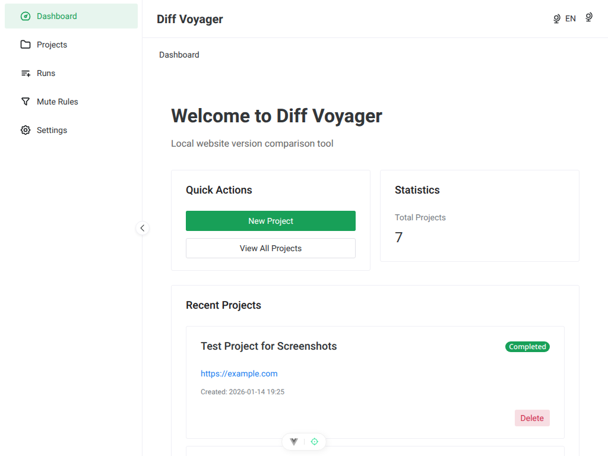
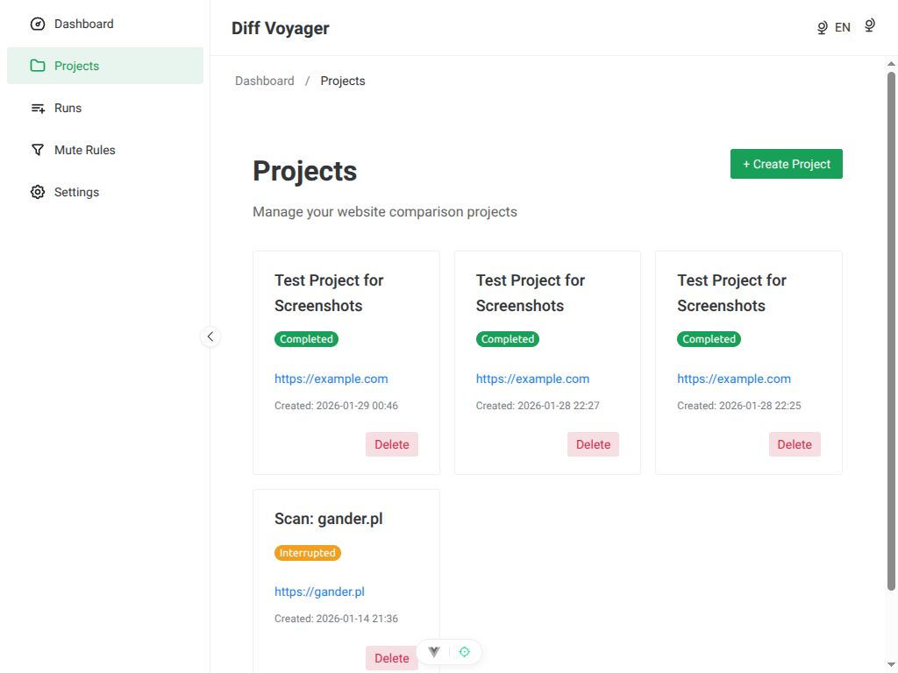
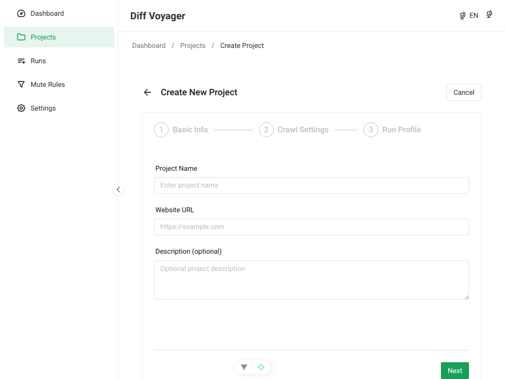
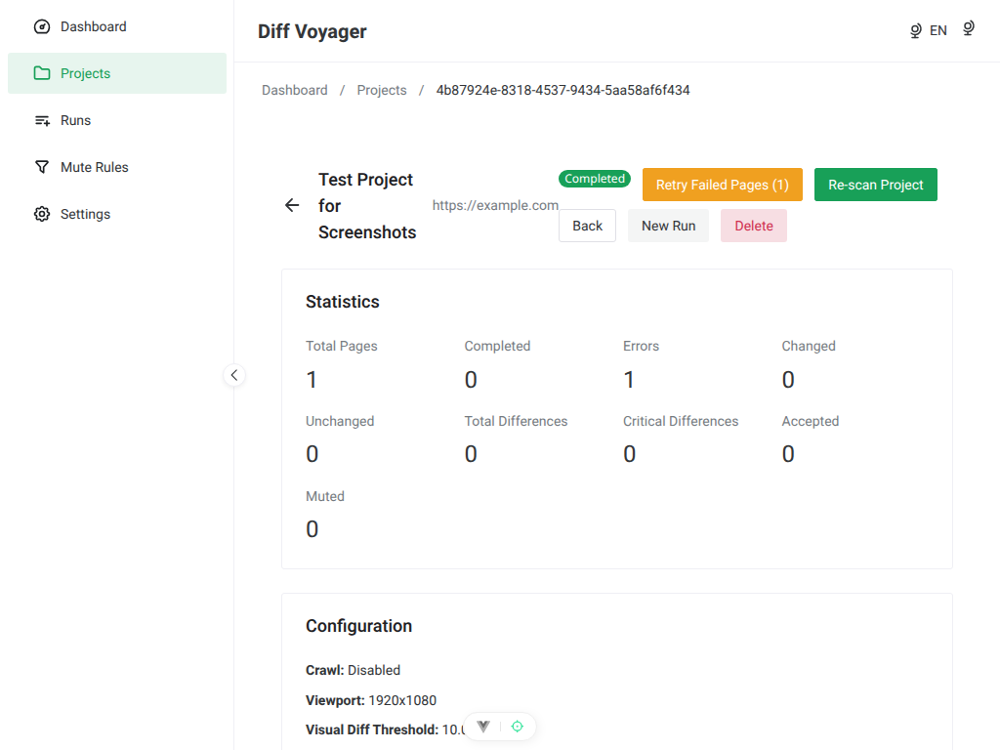

# Implementation Status

**Last Updated**: 2026-01-11

## Current Phase: Phase 5 Complete ✅ | Frontend Phase 2 Complete ✅

Diff Voyager has completed the core backend implementation with all API endpoints, crawler components, comparison logic, and storage layer fully functional. Frontend development is progressing with project management UI complete.

### Major Milestones

| Date | Milestone |
|------|-----------|
| 2025-12-27 | Project initialization |
| 2025-12-28 | Test infrastructure (Phase 0) |
| 2026-01-02 | Storage layer complete (Phase 1) |
| 2026-01-04 | Comparison logic complete (Phase 2) |
| 2026-01-05 | Crawler complete (Phase 3) |
| 2026-01-06 | Task queue complete (Phase 4) |
| 2026-01-07 | API layer complete (Phase 5) |
| 2026-01-08 | Drizzle ORM migration complete (all 6 repositories) |
| 2026-01-08 | Frontend Phase 1 complete (Foundation & Infrastructure) |
| 2026-01-09 | Frontend Phase 2 complete (Project Management UI) |
| 2026-01-11 | Retry functionality complete (Phase 6) |

## Phase Completion Overview

| Phase | Status | Completion | Description |
|-------|--------|-----------|-------------|
| **Phase 0** | ✅ Complete | 100% | Test infrastructure and foundation |
| **Phase 1** | ✅ Complete | 100% | Storage layer (Drizzle ORM migration complete) |
| **Phase 2** | ✅ Complete | 100% | Domain logic and comparators |
| **Phase 3** | ✅ Complete | 100% | Crawler and browser automation |
| **Phase 4** | ✅ Complete | 100% | Task queue and async processing |
| **Phase 5** | ✅ Complete | 100% | API layer (all 15 endpoints) |
| **Phase 6** | 🟡 Partial | 60% | Integration workflows |
| **Phase 7** | 🟡 Partial | 50% | Production polish |
| **Frontend** | 🟡 In Progress | 40% | Vue 3 UI (Phase 1 & 2 Complete) |

## Phase Details

### Phase 0: Foundation Setup ✅ (100%)

**Status**: Complete

**Completed Components**:
- ✅ Vitest test infrastructure
- ✅ MockServer for integration testing
- ✅ Test database helpers
- ✅ Factory functions for test data
- ✅ HTML fixtures for SEO testing
- ✅ Shared TypeScript types (API requests/responses)
- ✅ Build automation for shared package
- ✅ Zod schema validation tests (32 tests for shared package schemas)

**Test Coverage**:
- Unit tests: Comprehensive coverage
- Integration tests: All API endpoints
- Mock server: Full HTTP mocking

### Phase 1: Storage Layer ✅ (100%)

**Status**: Complete - All repositories migrated to Drizzle ORM

**Completed Components**:
- ✅ SQLite database schema with 3 migrations
- ✅ ProjectRepository (Drizzle)
- ✅ RunRepository (Drizzle)
- ✅ PageRepository (Drizzle)
- ✅ SnapshotRepository (Drizzle)
- ✅ DiffRepository (Drizzle)
- ✅ TaskQueue (Drizzle)
- ✅ Artifact file storage (screenshots, HTML, HAR)

**Drizzle Migration Status**: **100% Complete** 🎉
- All 6 repositories migrated from raw SQL to Drizzle ORM
- 25/25 migration tasks complete
- Benefits achieved:
  - Type-safe queries with compile-time validation
  - Automatic prepared statements (SQL injection protection)
  - JSON column type support
  - Better developer experience

See [Drizzle Migration Guide](../guides/drizzle-migration.md) for details.

**Test Coverage**:
- Repository unit tests: 100+ tests passing
- Comparison tests (SQL vs Drizzle): All passing

### Phase 2: Domain Logic ✅ (100%)

**Status**: Complete - All comparison algorithms implemented

**Completed Components**:
- ✅ URL Normalizer (path normalization, query handling, tracking parameters)
- ✅ SEO Comparator (title, meta, canonical, robots, H1/H2 changes)
- ✅ Visual Comparator (pixelmatch integration, diff image generation)
- ✅ Header Comparator (HTTP header differences)
- ✅ Performance Comparator (load time, request count, size deltas)
- ✅ Page Comparator (orchestration of all comparators)

**Test Coverage**:
- SEO Comparator: 15 tests passing
- Visual Comparator: 12 tests passing
- Header Comparator: 8 tests passing
- Performance Comparator: 10 tests passing
- Page Comparator: 18 tests passing

**Capabilities**:
- Detects SEO metadata changes (title, description, canonical, robots)
- Pixel-by-pixel visual diff with configurable threshold
- HTTP header comparison (added, removed, changed)
- Performance metrics comparison (load time, requests, size)
- Unified diff summary with severity classification

### Phase 3: Crawler ✅ (100%)

**Status**: Complete - Full crawler infrastructure operational

**Completed Components**:
- ✅ Browser Manager (Playwright browser pooling)
- ✅ Page Capturer (HTML, screenshots, SEO, performance, HAR)
- ✅ Single Page Processor (orchestrates capture and storage)
- ✅ Site Crawler (Crawlee integration for multi-page discovery)
- ✅ URL discovery and filtering
- ✅ Domain boundary checking
- ✅ Concurrent page processing

**Test Coverage**:
- BrowserManager: 17 tests passing
- PageCapturer: 24 tests passing
- Integration tests: Multi-page crawling verified

**Capabilities**:
- Browser instance pooling with race condition handling
- Full-page screenshots with configurable viewport
- SEO metadata extraction during capture
- HAR file generation (optional)
- Multi-page site crawling with same-domain strategy
- Configurable concurrency and max pages limit

### Phase 4: Task Queue ✅ (100%)

**Status**: Complete - SQLite-based async processing

**Completed Components**:
- ✅ Task queue core (enqueue, dequeue, complete, fail)
- ✅ Page task queue (batch operations)
- ✅ Task processor (background processing loop)
- ✅ Retry logic with configurable attempt limits
- ✅ Stale task recovery
- ✅ Graceful shutdown

**Test Coverage**:
- TaskQueue: 19 tests passing
- TaskProcessor: Full workflow tests

**Capabilities**:
- Persistent task storage (survives restart)
- Atomic task claiming (no double processing)
- Priority-based scheduling (HIGH > NORMAL > LOW)
- Automatic retry on failure
- Background task processing
- Clean shutdown handling

### Phase 5: API Layer ✅ (100%)

**Status**: Complete - All 15 endpoints implemented

**Completed Endpoints**:
- ✅ `POST /api/v1/scans` - Create scan (single page, sync/async modes)
- ✅ `GET /api/v1/projects` - List all projects with pagination
- ✅ `GET /api/v1/projects/:id` - Get project details with pages
- ✅ `POST /api/v1/projects/:id/runs` - Create comparison run
- ✅ `GET /api/v1/projects/:id/runs` - List runs for project
- ✅ `GET /api/v1/runs/:id` - Run details with statistics
- ✅ `GET /api/v1/runs/:id/pages` - Pages list with filtering
- ✅ `POST /api/v1/runs/:runId/retry` - Retry failed pages in run ⚡NEW
- ✅ `GET /api/v1/pages/:id` - Page details with latest snapshot
- ✅ `GET /api/v1/pages/:id/diff` - Detailed diff comparison
- ✅ `POST /api/v1/snapshots/:snapshotId/retry` - Retry failed snapshot ⚡NEW
- ✅ `GET /api/v1/tasks/:id` - Task status and progress
- ✅ `GET /api/v1/artifacts/:pageId/*` - Retrieve artifacts (screenshot, HTML, HAR)
- ✅ `GET /health` - Health check
- ✅ `GET /docs` - Swagger UI

**Test Coverage**:
- API integration tests: 39/42 passing (3 skipped)
- Request validation: All scenarios tested
- Error handling: Comprehensive coverage

**Features**:
- Full Swagger/OpenAPI documentation at `/docs`
- Rate limiting on all endpoints
- Path traversal prevention with symlink protection
- JSON schema validation
- Secure file access

**Known Issues**:
- 3 tests skipped (snapshot data retrieval) - see [Skipped Tests](#skipped-tests)

### Phase 6: Integration & Workflows 🟡 (60%)

**Status**: Partial - Core workflows working, retry functionality complete

**Completed**:
- ✅ ScanProcessor (orchestrates project → run → capture → storage)
- ✅ Single page baseline capture (sync mode)
- ✅ Multiple comparison runs per project
- ✅ Artifact persistence (screenshots, HTML, performance data)
- ✅ Async task processing integration
- ✅ Retry functionality for failed snapshots ⚡NEW
- ✅ Retry functionality for failed runs (all or failed-only scope) ⚡NEW

**Pending**:
- ⏳ Baseline vs run comparison workflow
- ⏳ Automatic diff generation during comparison runs
- ⏳ Multi-page crawl workflow (Crawlee integration exists but not fully tested)

**Blockers**: None - all dependencies complete (Phase 2, 3, 4 done)

### Phase 7: Polish & Production Ready 🟡 (50%)

**Status**: Partial - Core security in place, optimization pending

**Completed**:
- ✅ Rate limiting on all API endpoints
- ✅ Path traversal prevention with symlink protection
- ✅ Input validation and error sanitization
- ✅ Swagger/OpenAPI documentation
- ✅ Integration tests with mock server

**Pending**:
- ⏳ Complete error scenario tests
- ⏳ Database query optimization and indexing
- ⏳ Performance benchmarking and optimization
- ⏳ Connection pooling

### Frontend UI 🟡 (40%)

**Status**: In Progress - Phase 1 & 2 Complete (Foundation & Project Management)

**Completed (Phase 1)** ✅:
- ✅ Frontend dependencies and configuration (Vite, TypeScript, path aliases)
- ✅ Typed API client with retry logic and error handling (ofetch)
- ✅ i18n setup with English and Polish translations (300+ keys)
- ✅ Pinia stores for state management (7 stores: ui, projects, runs, pages, diffs, rules, tasks)
- ✅ Layout components (DefaultLayout, AppHeader, AppSidebar, AppBreadcrumb)
- ✅ Common UI components (LoadingSpinner, ErrorAlert, EmptyState, ConfirmDialog, Pagination)
- ✅ Vue Router with all 11 application routes configured
- ✅ Naive UI integration with theme support
- ✅ 63 tests passing (TDD methodology)

**Completed (Phase 2)** ✅:
- ✅ Backend DELETE endpoint with cascade deletion
- ✅ Zod validation schemas for project creation (32 tests)
- ✅ ProjectsStore with full CRUD operations (17 tests)
- ✅ DashboardView with statistics and recent projects (8 tests)
- ✅ ProjectListView with pagination and grid layout (6 tests)
- ✅ ProjectForm multi-step wizard (3 steps: Basic Info, Crawl Settings, Run Profile) (6 tests)
- ✅ ProjectCreateView with form integration (5 tests)
- ✅ ProjectStatusBadge component with color coding (8 tests)
- ✅ ProjectStatistics component with grid layout (7 tests)
- ✅ ProjectCard reusable component with actions (10 tests)
- ✅ ProjectDetailView with full project information (10 tests)
- ✅ 62 new tests (167 total frontend tests passing)

**In Progress (Phase 3)**:
- ⏳ Run management views (RunList, RunCreate, RunDetail)

**Pending**:
- ⏳ Diff review interface (Phase 4)
- ⏳ Rules and settings views (Phase 5)
- ⏳ Polish, accessibility, and E2E testing (Phase 6)

**Current UI Capabilities**:
- Responsive layout with collapsible sidebar
- Theme switching (light/dark/auto)
- Language switching (English/Polish)
- Navigation menu with active route highlighting
- Complete project management CRUD interface
- Dashboard with statistics and quick actions
- Multi-step project creation wizard
- Project list with pagination (12 per page, 3 columns)
- Project detail view with statistics and configuration
- Reusable components for status badges, statistics, and project cards
- Delete confirmation with cascade deletion

**Visual Preview**:

See [UI Screenshots](../screenshots/README.md) for complete gallery. Key views completed in Phase 2:

**Dashboard** (Phase 2 Complete):

**Projects List** (Phase 2 Complete):

**Project Creation Wizard** (Phase 2 Complete):

**Project Detail View** (Phase 2 Complete):

For more screenshots, see [docs/screenshots/README.md](../screenshots/README.md).

See [Frontend Implementation Plan](../features/frontend-plan.md) and [Frontend Status](../features/frontend-status.md) for details.

## Current Capabilities

### ✅ What Works Now

**Page Capture & Storage**:
- ✅ Single page scanning (sync and async modes)
- ✅ HTML, HTTP headers, and status code capture
- ✅ SEO metadata extraction (title, meta description, canonical, robots, H1)
- ✅ Full-page screenshots with configurable viewport
- ✅ Performance metrics collection
- ✅ HAR file capture (optional)
- ✅ SQLite database storage with Drizzle ORM

**Project Management**:
- ✅ Project creation with baseline runs
- ✅ Multiple comparison runs per project
- ✅ URL normalization and duplicate detection
- ✅ Artifact file storage and retrieval

**API & Documentation**:
- ✅ RESTful API with Fastify
- ✅ Swagger UI at `/docs` for interactive testing
- ✅ Request validation and error handling
- ✅ Rate limiting and security headers
- ✅ Path traversal protection

**Comparison Logic**:
- ✅ SEO comparison (title, meta, canonical, robots, H1)
- ✅ Visual comparison (pixelmatch integration)
- ✅ HTTP header comparison
- ✅ Performance metrics comparison
- ✅ Full page comparison orchestration

**Crawler Infrastructure**:
- ✅ Browser manager for instance pooling
- ✅ Single page processor
- ✅ Multi-page site crawling with Crawlee
- ✅ Link discovery and following
- ✅ Domain boundary checking
- ✅ Concurrent page processing

**Testing**:
- ✅ Unit tests for domain logic
- ✅ Integration tests with mock HTTP server
- ✅ Repository layer tests
- ✅ API endpoint tests

**Frontend Project Management**:
- ✅ Dashboard with statistics and recent projects
- ✅ Project list with pagination (12 per page)
- ✅ Multi-step project creation wizard
- ✅ Project detail view with full information
- ✅ CRUD operations (create, read, update, delete)
- ✅ Form validation with Zod schemas
- ✅ Reusable UI components (ProjectCard, ProjectStatusBadge, ProjectStatistics)

### 🟡 Partially Working

**Diff Integration**:
- ✅ All comparators implemented and tested
- ⏳ Workflow integration pending (automatic diff generation during runs)
- ⏳ Diff API endpoint ready but needs workflow connection

**Multi-page Crawling**:
- ✅ Crawlee integration complete
- ✅ URL discovery working
- ⏳ End-to-end multi-page crawl workflow needs verification

### ❌ Not Yet Available

**Diff Management**:
- ❌ Diff acceptance workflow
- ❌ Mute rules creation and application

**Frontend UI**:
- ❌ Run management UI (Phase 3)
- ❌ Visual diff review (Phase 4)
- ❌ Rules and settings UI (Phase 5)

## Skipped Tests

**Total**: 4 backend integration tests currently skipped. See detailed tracking in GitHub Issues:

### Phase 1: Fix Skipped Tests (High Priority)

- [Issue #156](https://github.com/gander-tools/diff-voyager/issues/156) - `includePages` parameter coercion (HIGH)
- [Issue #148](https://github.com/gander-tools/diff-voyager/issues/148) - Page details response structure investigation (MEDIUM, parent)
  - [Issue #151](https://github.com/gander-tools/diff-voyager/issues/151) - SEO data in response
  - [Issue #152](https://github.com/gander-tools/diff-voyager/issues/152) - HTTP headers in response
  - [Issue #153](https://github.com/gander-tools/diff-voyager/issues/153) - Performance metrics in response
- [Issue #157](https://github.com/gander-tools/diff-voyager/issues/157) - HAR file URL handling (MEDIUM)

Full documentation: [Skipped Tests Guide](./skipped-tests.md)

## Next Priorities

1. **Frontend Phase 3** - Run management UI (RunList, RunCreate, RunDetail)
2. **Fix Skipped Tests** - [Tracked in issues #156, #148, #151-153, #157](https://github.com/gander-tools/diff-voyager/milestone/1)
3. **Diff Workflow Integration** - [Issue #149](https://github.com/gander-tools/diff-voyager/issues/149), [Issue #154](https://github.com/gander-tools/diff-voyager/issues/154)
4. **Frontend Phase 4** - Diff review interface with visual comparison
5. **Multi-page Crawl Verification** - [Issue #158](https://github.com/gander-tools/diff-voyager/issues/158)

See [GitHub Milestone: Documentation TODO Cleanup](https://github.com/gander-tools/diff-voyager/milestone/1) for complete tracking of backend tasks.

## Performance Metrics

### Test Execution

- **Backend unit tests**: ~200 tests in < 2 seconds
- **Backend integration tests**: ~50 tests in < 10 seconds
- **Frontend tests**: 167 tests in ~11 seconds
- **Total coverage**: > 80% (backend), > 85% (frontend)

### API Response Times

- **Single page scan (sync)**: 2-5 seconds (depends on page size)
- **Project retrieval**: < 50ms
- **Artifact retrieval**: < 100ms

### Database Performance

- **SQLite with WAL mode**: Concurrent reads supported
- **Drizzle ORM**: Zero runtime overhead
- **Query execution**: < 10ms for most operations

## See Also

- [Roadmap](roadmap.md) - Planned features and next steps
- [API Overview](../api/overview.md) - API implementation details
- [Architecture Overview](../architecture/overview.md) - System design
