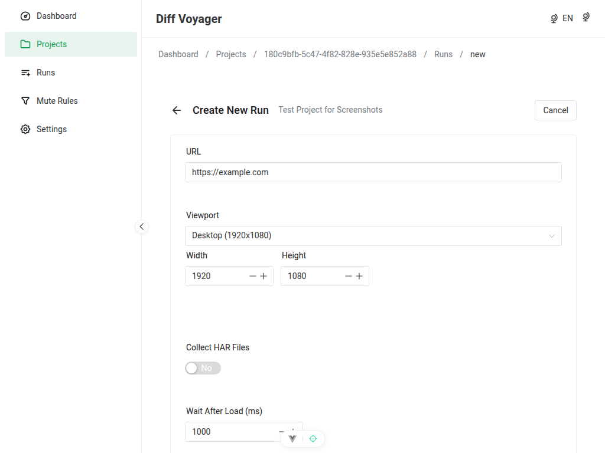
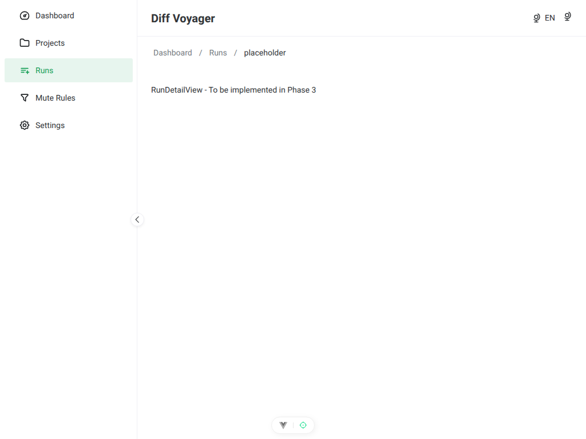
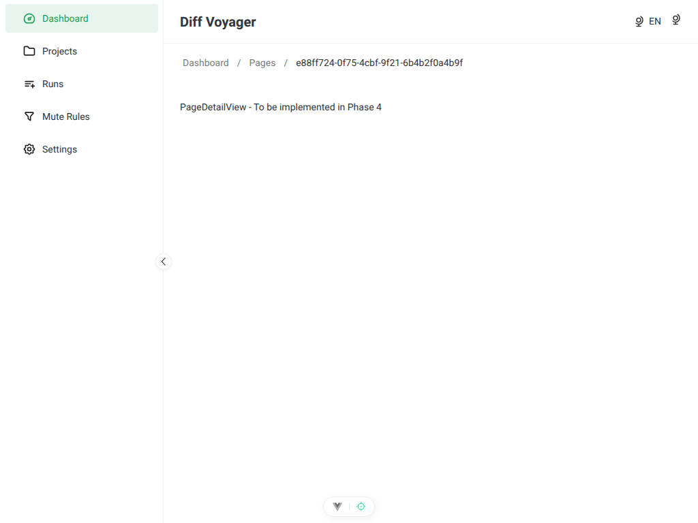
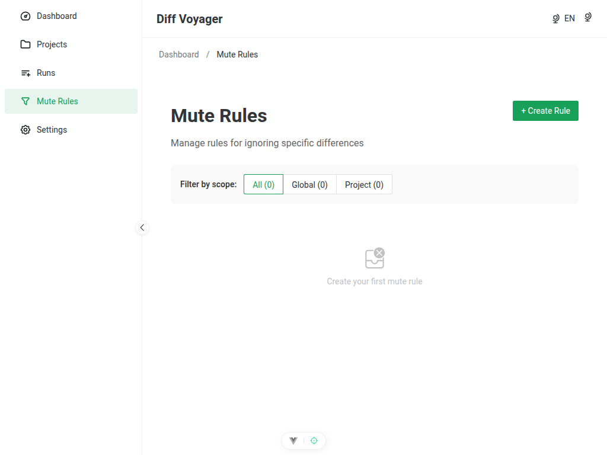
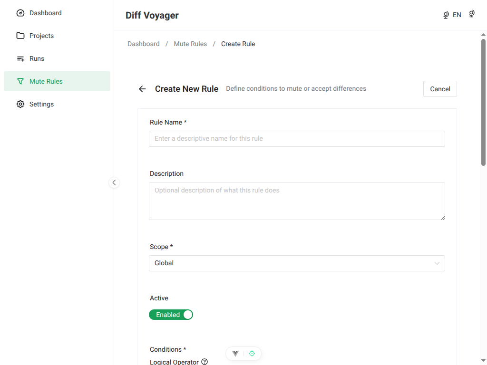
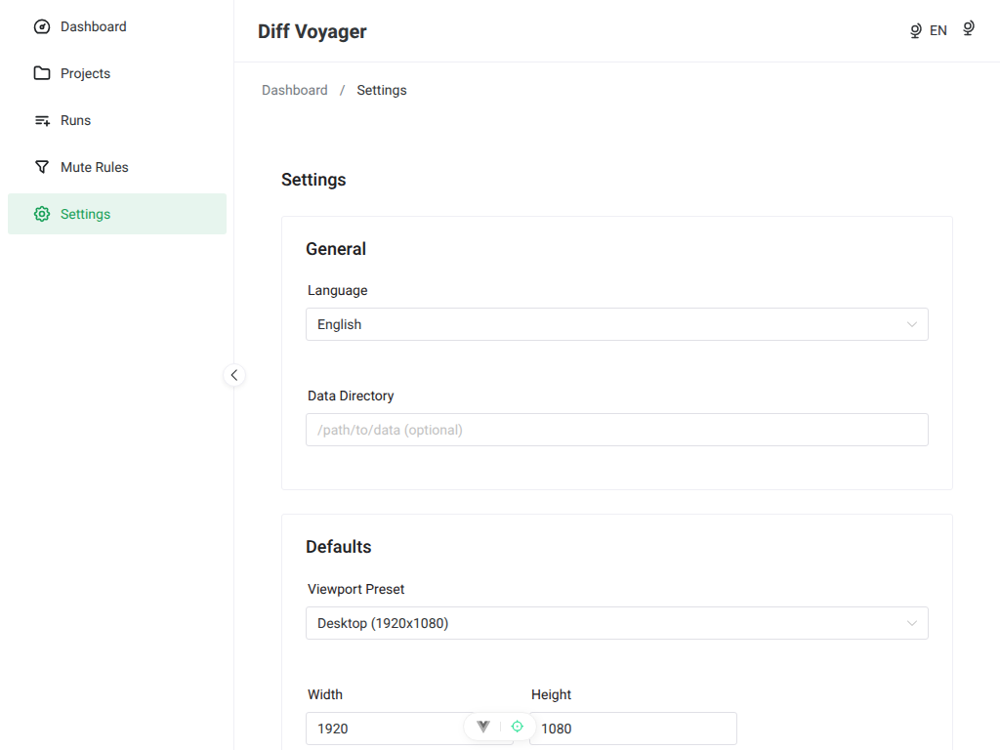
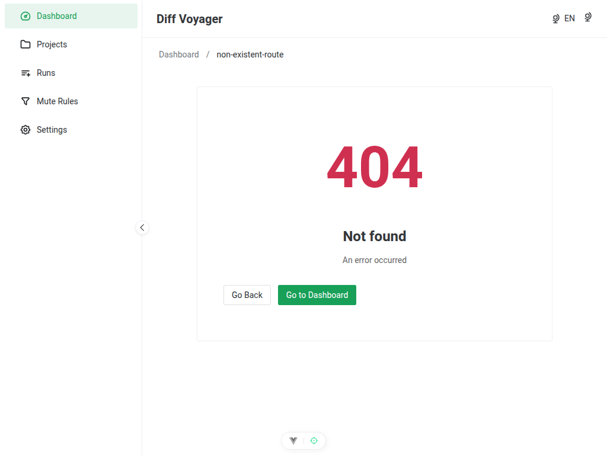

# UI Screenshots Index

**Last Generated**: 2026-01-09
**Viewport**: 1024x768
**Generator**: `scripts/generate-screenshots.ts`

---

## How to Regenerate

```bash
npm run screenshots
```

This command:
1. Starts backend and frontend servers automatically
2. Creates test project data via API
3. Captures all 11 views using Playwright
4. Saves screenshots to this directory
5. Stops servers when complete

---

## Screenshot Gallery

### 01. Dashboard (`/`)


**Features shown**:
- Welcome message and description
- Quick action buttons (New Project, All Projects)
- Project statistics cards (Total, Active, Completed)
- Recent projects list with delete action
- Empty state when no projects exist

**Phase**: Phase 2 Complete ✅

---

### 02. Projects List (`/projects`)


**Features shown**:
- Page header with "New Project" button
- 3-column grid layout (responsive)
- ProjectCard components with:
  - Project name and URL
  - Status badge
  - Creation date
  - Quick actions (View, Delete)
- Pagination controls (12 per page)
- Empty state when no projects

**Phase**: Phase 2 Complete ✅

---

### 03. Project Create (`/projects/new`)


**Features shown**:
- Multi-step wizard progress (3 steps)
- Step 1: Basic Information
  - Project Name input (required)
  - Website URL input (required)
  - Description textarea (optional)
- Real-time validation with error messages
- Back/Cancel and Next buttons
- Form validation with vee-validate + Zod

**Phase**: Phase 2 Complete ✅

---

### 04. Project Detail (`/projects/:id`)


**Features shown**:
- Back button and page title
- Project URL display
- Status badge
- Action buttons (New Run, Delete)
- Project description section
- Statistics grid:
  - Total pages
  - Compared pages
  - Pages with errors
  - Pending pages
- Configuration display:
  - Crawl settings (enabled/disabled, max pages)
  - Viewport dimensions
  - Visual diff threshold
  - HAR collection status

**Phase**: Phase 2 Complete ✅

---

### 05. Run Create (`/projects/:projectId/runs/new`)



**Features shown**:
- Run creation form (placeholder)
- Planned for Phase 3

**Phase**: Phase 3 Planned ⏳

---

### 06. Run Detail (`/runs/:runId`)



**Features shown**:
- Run detail view (placeholder)
- Run status, statistics, and page list
- Planned for Phase 3

**Phase**: Phase 3 Planned ⏳

---

### 07. Page Detail (`/pages/:pageId`)



**Features shown**:
- Page comparison details (placeholder)
- Visual diff viewer
- SEO comparison
- Performance metrics
- Planned for Phase 4

**Phase**: Phase 4 Planned ⏳

---

### 08. Rules List (`/rules`)



**Features shown**:
- Mute rules list (placeholder)
- Rule management interface
- Planned for Phase 5

**Phase**: Phase 5 Planned ⏳

---

### 09. Rule Create (`/rules/new`)



**Features shown**:
- Rule creation form (placeholder)
- CSS/XPath selector input
- Scope selection (global/project)
- Planned for Phase 5

**Phase**: Phase 5 Planned ⏳

---

### 10. Settings (`/settings`)



**Features shown**:
- Application settings (placeholder)
- Theme, language, and advanced options
- Planned for Phase 5

**Phase**: Phase 5 Planned ⏳

---

### 11. Not Found (404)



**Features shown**:
- 404 error page
- Friendly error message
- "Go Back" and "Go Home" buttons
- Theme-aware styling

**Phase**: Phase 1 Complete ✅

---

## Technical Details

### Generator Script

**Location**: `scripts/generate-screenshots.ts`

**Dependencies**:
- `playwright` - Browser automation
- `tsx` - TypeScript execution
- Backend API (auto-started)
- Frontend dev server (auto-started)

**Configuration**:
- **Viewport**: 1024x768
- **Wait after load**: 500ms (for Vue hydration)
- **Test data**: Creates project via `POST /api/v1/scans`
- **Headless**: Yes (no browser window)

### File Naming Convention

Format: `{number}-{route-name}.png`

- **Number**: 01-11 (maintains order)
- **Route name**: Descriptive kebab-case
- **Extension**: .png (lossless)

### Version Control

Screenshots are **version controlled** in git (included in commits).

**Rationale**: Documentation screenshots should be available immediately after cloning the repository, without requiring manual regeneration.

---

## Usage in Documentation

Screenshots are used in:

1. **frontend-status.md** - Complete UI walkthrough with all 11 screenshots
2. **implementation-status.md** - Phase progress visualization (Phase 1 & 2 complete)
3. **README.md** (future) - Quick preview of the application

---

## Maintenance

**When to regenerate**:
- After UI changes (new components, layout updates)
- After Phase completion (new views implemented)
- Before creating pull requests with frontend changes
- When documentation screenshots are outdated

**Verification**:
1. Run `npm run screenshots`
2. Check `docs/screenshots/` for updated files
3. Verify timestamps (should be recent)
4. Review screenshots visually for correctness

**Troubleshooting**:
- Ensure ports 3000 and 5173 are free
- Check Playwright installation: `npx playwright install`
- Verify backend builds: `npm run build:backend`
- Check frontend runs: `npm run dev:frontend`
