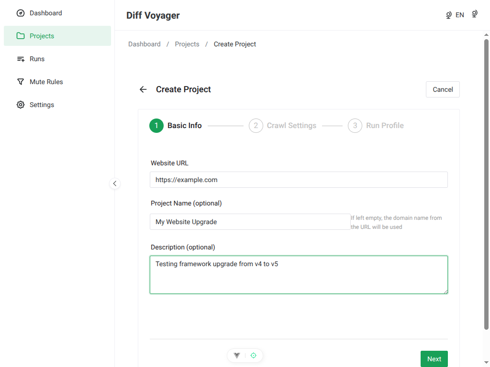
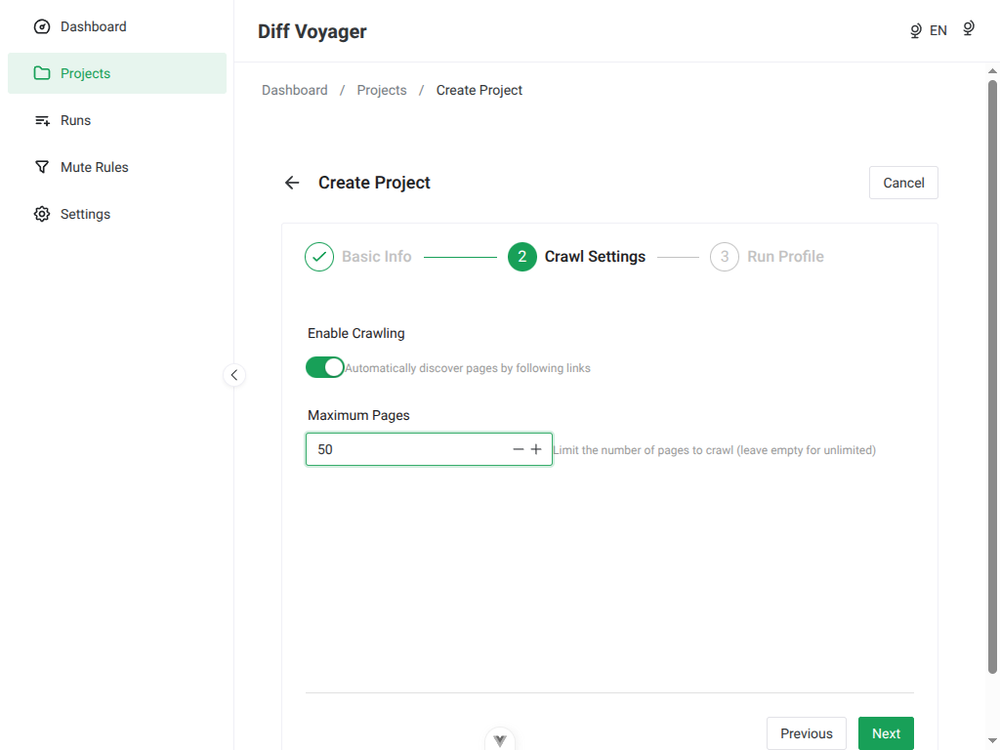
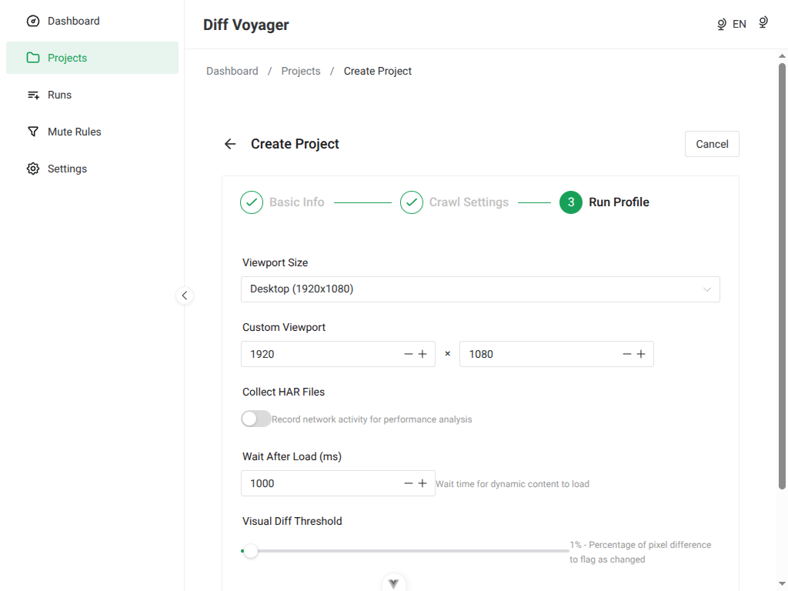

# UI Screenshots Index

**Last Generated**: 2026-01-31
**Viewport**: 1024x768
**Generator**: Heroshot (`.heroshot/config.json`)

---

## How to Regenerate

```bash
npm run screenshots
```

This command uses [Heroshot](https://heroshot.sh/) to automatically capture all UI views.

**Prerequisites**:
- Frontend dev server must be running: `npm run dev:frontend`
- Backend server required for views with data

---

## Screenshot Gallery

### 01. Dashboard (`/`)


**Features shown**:
- Welcome message and description
- Quick action buttons (New Project, All Projects)
- Project statistics cards (Total, Active, Completed)
- Recent projects list with delete action
- Empty state when no projects exist

**Phase**: Phase 2 Complete ✅

---

### 02. Projects List (`/projects`)


**Features shown**:
- Page header with "New Project" button
- 3-column grid layout (responsive)
- ProjectCard components with:
  - Project name and URL
  - Status badge
  - Creation date
  - Quick actions (View, Delete)
- Pagination controls (12 per page)
- Empty state when no projects

**Phase**: Phase 2 Complete ✅

---

### 03. Project Create - Step 1: Basic Info (`/projects/new`)



**Features shown**:
- Multi-step wizard progress indicator (Step 1 of 3)
- Basic Information form:
  - Website URL input (required) - filled with `https://example.com`
  - Project Name input (required) - filled with `My Website Upgrade`
  - Description textarea (optional) - filled with example text
- Real-time validation with error messages
- Next button to proceed to Step 2
- Form validation with vee-validate + Zod

**Phase**: Phase 2 Complete ✅

---

### 03. Project Create - Step 2: Crawl Settings (`/projects/new`)



**Features shown**:
- Multi-step wizard progress indicator (Step 2 of 3)
- Crawl Settings form:
  - Enable Crawling toggle switch (enabled)
  - Max Pages input - set to `50`
  - Helpful hints for each field
- Back and Next buttons for navigation
- Step navigation working with form state preservation

**Phase**: Phase 2 Complete ✅

---

### 03. Project Create - Step 3: Run Profile (`/projects/new`)



**Features shown**:
- Multi-step wizard progress indicator (Step 3 of 3)
- Run Profile configuration:
  - Viewport size preset selector
  - Custom viewport dimensions (width × height)
  - Collect HAR files toggle
  - Wait after load timing
  - Visual diff threshold slider
- Back button and Create Project button
- Final step before project creation

**Phase**: Phase 2 Complete ✅

---

### 04. Project Detail (`/projects/:id`)


**Features shown**:
- Back button and page title
- Project URL display
- Status badge
- Action buttons (New Run, Delete)
- Project description section
- Statistics grid:
  - Total pages
  - Compared pages
  - Pages with errors
  - Pending pages
- Configuration display:
  - Crawl settings (enabled/disabled, max pages)
  - Viewport dimensions
  - Visual diff threshold
  - HAR collection status

**Phase**: Phase 2 Complete ✅

---

### 05. Run Create (`/projects/:projectId/runs/new`)


**Features shown**:
- Run creation form (placeholder)
- Planned for Phase 3

**Phase**: Phase 3 Planned ⏳

---

### 06. Run Detail (`/runs/:runId`)


**Features shown**:
- Run detail view (placeholder)
- Run status, statistics, and page list
- Planned for Phase 3

**Phase**: Phase 3 Planned ⏳

---

### 07. Page Detail (`/pages/:pageId`)


**Features shown**:
- Page comparison details (placeholder)
- Visual diff viewer
- SEO comparison
- Performance metrics
- Planned for Phase 4

**Phase**: Phase 4 Planned ⏳

---

### 08. Rules List (`/rules`)


**Features shown**:
- Mute rules list (placeholder)
- Rule management interface
- Planned for Phase 5

**Phase**: Phase 5 Planned ⏳

---

### 09. Rule Create (`/rules/new`)


**Features shown**:
- Rule creation form (placeholder)
- CSS/XPath selector input
- Scope selection (global/project)
- Planned for Phase 5

**Phase**: Phase 5 Planned ⏳

---

### 10. Settings (`/settings`)


**Features shown**:
- Application settings (placeholder)
- Theme, language, and advanced options
- Planned for Phase 5

**Phase**: Phase 5 Planned ⏳

---

### 11. Not Found (404)


**Features shown**:
- 404 error page
- Friendly error message
- "Go Back" and "Go Home" buttons
- Theme-aware styling

**Phase**: Phase 1 Complete ✅

---

## Technical Details

### Heroshot Configuration

**Location**: `.heroshot/config.json`

**Tool**: [Heroshot](https://heroshot.sh/) - Config-based screenshot generation for web applications

**Configuration**:
- **Viewport**: 1024x768
- **Output Directory**: `docs/screenshots/`
- **Format**: PNG (lossless)
- **Total Screenshots**: 13 (including 3 wizard steps)

**Key Features**:
- Automated browser interactions via Actions API
- Multi-step form navigation with `click`, `type`, and `wait` actions
- Config-based approach (no code changes needed)
- Consistent screenshot naming convention

### Actions Used

**Form Interactions**:
- `type` - Fill form fields with text
- `click` - Click buttons, toggles, navigation
- `wait` - Allow Vue hydration and transitions

**Example Configuration** (Project Create Step 2):
```json
{
  "name": "03-project-create-step2",
  "url": "http://localhost:5173/projects/new",
  "actions": [
    {"type": "wait", "time": 1},
    {"type": "type", "selector": "[data-test=\"url-input\"] input", "text": "https://example.com"},
    {"type": "type", "selector": "[data-test=\"name-input\"] input", "text": "My Website Upgrade"},
    {"type": "wait", "time": 0.3},
    {"type": "click", "selector": "[data-test=\"next-step-btn\"]"},
    {"type": "wait", "time": 0.5},
    {"type": "click", "selector": ".n-switch"},
    {"type": "type", "selector": ".n-input-number input", "text": "50"}
  ]
}
```

### File Naming Convention

Format: `{number}-{route-name}.png`

- **Number**: 01-11 (maintains order in documentation)
- **Route name**: Descriptive kebab-case
- **Extension**: .png (lossless compression)

**Multi-step forms**: Use `-step{n}` suffix (e.g., `03-project-create-step1.png`)

### Version Control

Screenshots are **version controlled** in git (included in commits).

**Rationale**: Documentation screenshots should be available immediately after cloning the repository, without requiring manual regeneration.

---

## Usage in Documentation

Screenshots are used in:

1. **roadmap.md** - Current status and phase progress visualization
2. **README.md** (future) - Quick preview of the application
3. **CLAUDE.md** - Development guide with visual examples

---

## Maintenance

### When to Regenerate

- After UI changes (new components, layout updates)
- After Phase completion (new views implemented)
- Before creating pull requests with frontend changes
- When documentation screenshots are outdated

### Regeneration Steps

1. **Start frontend dev server**:
   ```bash
   npm run dev:frontend
   ```

2. **Generate screenshots**:
   ```bash
   npm run screenshots
   ```

3. **Verify output**:
   ```bash
   ls -lh docs/screenshots/*.png
   ```

4. **Review visually**:
   - Open each screenshot to verify correctness
   - Check that form data is filled properly
   - Verify step navigation in multi-step wizard

### Adding New Screenshots

1. **Edit configuration**: `.heroshot/config.json`
2. **Add new screenshot object**:
   ```json
   {
     "name": "12-new-view",
     "url": "http://localhost:5173/new-view",
     "actions": [
       {"type": "wait", "time": 0.5}
     ]
   }
   ```
3. **Run generation**: `npm run screenshots`
4. **Update this README** with new screenshot entry

### Troubleshooting

**Issue**: Screenshots missing or incomplete
- **Solution**: Ensure frontend dev server is running on port 5173

**Issue**: Form fields not filled correctly
- **Solution**: Check selector accuracy in `.heroshot/config.json`
- Use browser DevTools to verify CSS selectors
- Test selectors with `document.querySelector('[data-test="..."]')`

**Issue**: Multi-step wizard navigation fails
- **Solution**: Increase wait times between `click` and `wait` actions
- Verify button selectors (`[data-test="next-step-btn"]`)
- Check if form validation is blocking navigation

**Issue**: Heroshot command not found
- **Solution**: Ensure heroshot is installed: `npm install --save-dev heroshot@^0.11.0`

---

## Heroshot Resources

- **Documentation**: https://heroshot.sh/docs/
- **GitHub Repository**: https://github.com/omachala/heroshot
- **Actions Reference**: https://heroshot.sh/docs/actions-reference
- **Config Reference**: https://heroshot.sh/docs/config-reference
